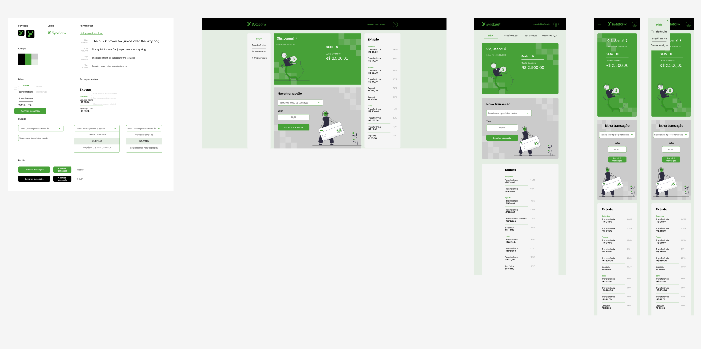

# Este repositório foi criado apartir de um Curso de testes com Cypress da Alura, para aprimorar minhas habilidades em testes de front/back com cypress.

O Bytebank é uma start up de banco digital criada para desenvolvedores e desenvolvedoras. Atualmente está na fase de desenvolvimento e conforme novas funcionalidades são adicionadas novos testes precisam ser feitos, por isso iremos escrever e melhores os testes de ponta a ponta existente na aplicação utilizando o Cypress.

O Bytebank é uma Start up fictícia utilizada nesse curso da Alura.
A ideia principal desse curso é mostrar como escrever e melhorar os testes de ponta a ponta utilizando a ferramenta Cypress.
